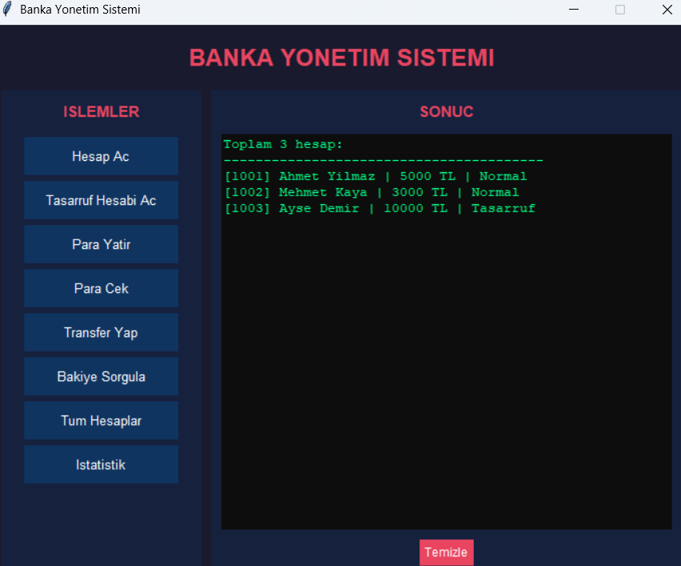

# 🏦 Banka Yönetim Sistemi (Bank Management System)

Python ve **Tkinter** kütüphanesi kullanılarak, Nesne Yönelimli Programlama (OOP) prensipleriyle geliştirilmiş grafik arayüzlü (GUI) bir bankacılık yönetim uygulamasıdır.

## 🛠 Kullanılan Teknolojiler
- **Programlama Dili:** Python 3.x
- **Grafik Arayüz:** Tkinter (GUI)
- **Mimari Yapı:** Nesne Yönelimli Programlama (OOP)

## 📁 Proje Yapısı ve Dosyalar
- `main.py`: Uygulamanın giriş noktasıdır; `BankaGUI` sınıfını çağırarak programı başlatır.
- `gui.py`: Tkinter ile tasarlanmış modern kullanıcı arayüzüdür; tüm görsel butonları, pencereleri ve ekran çıktılarını yönetir.
- `banka.py`: Hesap açma, hesap silme, para transferi ve banka istatistikleri gibi merkezi bankacılık mantığını yürüten ana `Banka` sınıfını içerir.
- `hesap.py`: Temel hesap bilgilerini (hesap no, sahip, bakiye) ve para hareketlerini barındıran temel sınıftır (Kapsülleme örneği).
- `tasarruf_hesabi.py`: Faiz hesaplama ve uygulama özelliği eklenmiş, `Hesap` sınıfından türetilen alt sınıftır (Kalıtım örneği).

## 🚀 Öne Çıkan Özellikler
- **Çift Hesap Türü:** Normal hesap ve faiz oranlı "Tasarruf Hesabı" açabilme.
- **Finansal İşlemler:** Güvenli para yatırma, para çekme ve iki hesap arasında anlık bakiye transferi.
- **Detaylı Raporlama:** Hesap bazlı bakiye sorgulama, geçmiş işlemler (ekstre) takibi ve tüm aktif hesapları listeleme.
- **Banka İstatistikleri:** Toplam hesap sayısı, hesap türü dağılımları ve bankadaki toplam nakit akışını anlık görüntüleme.

## 🧠 Uygulanan OOP Prensipleri
- **Kapsülleme (Encapsulation):** `hesap.py` ve `banka.py` içerisindeki kritik veriler (bakiye, hesap listesi vb.) `__` (private) belirteci ile korunarak dışarıdan yetkisiz ve doğrudan müdahalelere kapatılmıştır. Verilere güvenli erişim getter metotları ile sağlanmıştır.
- **Kalıtım (Inheritance):** `TasarrufHesabi` sınıfı, `Hesap` sınıfından miras alarak (super()) temel özellikleri devralmış ve kod tekrarını önlemiştir.
- **Çok Biçimlilik (Polymorphism / Method Overriding):** `bilgi_goster` metodu `TasarrufHesabi` sınıfında override edilerek, tasarruf hesaplarının ekrana faiz yüzdesiyle birlikte kendine has bir formatta yazdırılması sağlanmıştır.

## ⚙️ Kurulum ve Çalıştırma
1. Bilgisayarınızda Python 3.x sürümünün kurulu olduğundan emin olun.
2. Projedeki 5 adet Python dosyasını (`main.py`, `gui.py`, `banka.py`, `hesap.py`, `tasarruf_hesabi.py`) bilgisayarınızda **aynı klasör içerisine** indirin.
3. Terminal, Komut İstemi (CMD) veya terminal destekli bir editör (VS Code, PyCharm vb.) açarak klasör dizinine gidin ve şu komutu çalıştırın:
   ```bash
   python main.py

   # 🏦 Banka Yönetim Sistemi (Bank Management System)



Python ve **Tkinter** kütüphanesi kullanılarak, Nesne Yönelimli Programlama (OOP) prensipleriyle geliştirilmiş grafik arayüzlü (GUI) bir bankacılık yönetim uygulamasıdır.
